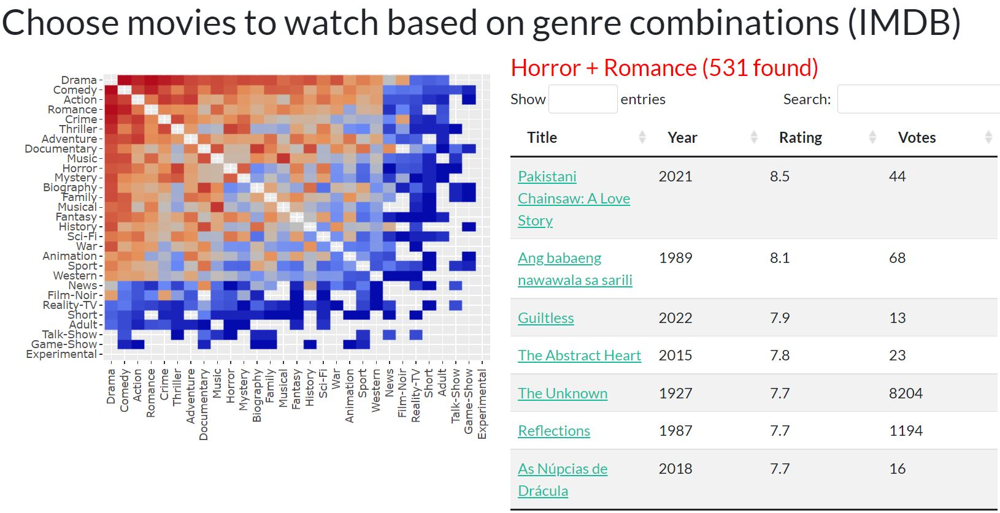

# IMDb Bizarre

Find movies by unusual genre pairings in the IMDb non-adult feature-film catalog.

**Live app:** <https://iamkulikov-imdb-bizzare.share.connect.posit.cloud/>



## How it works

The heatmap shows how often each genre pair appears across all movies. Brighter tiles mean more films share that combination; darker tiles highlight rare or “bizarre” mixes. Click a cell to list matching titles with year, rating, and vote count. Title links open the film on IMDb.

Genre order follows pair frequency: common genres sit toward the top-left, rare pairings toward the bottom-right.

## Project layout

```         
app.R                      # Shiny UI and server
do_beauty.R                # Startup: loads prebuilt heatmap cache
genre_script.R             # IMDb import helpers and genre-pair logic
scripts/prepare_runtime_data.R   # Builds movies.rds and heatmap.rds from CSV
movies.csv                 # Movie catalog (source, not loaded at startup)
pairs_count.csv            # Genre-pair counts (source for heatmap rebuild)
movies.rds                 # Optimized catalog (lazy-loaded on first click)
heatmap.rds                # Prebuilt plotly heatmap + genre metadata
archive/                   # Historical prototypes (not used at runtime)
```

## Quick start

1.  Install R packages: `shiny`, `bslib`, `dplyr`, `ggplot2`, `plotly`, `readr`, `DT`, `glue`, `stringr`, `tidyr`, `tibble`, `jsonlite`.

2.  Place `movies.csv` and `pairs_count.csv` in the project root (or rebuild them from IMDb TSV exports via `update_data <- 1` in `do_beauty.R`).

3.  Build runtime artifacts:

    ``` bash
    Rscript scripts/prepare_runtime_data.R
    ```

4.  Run locally:

    ``` r
    shiny::runApp("app.R")
    ```

5.  Deploy — see [Deploy to Posit Connect Cloud](#deploy-to-posit-connect-cloud) below.

## Deploy to Posit Connect Cloud {#deploy-to-posit-connect-cloud}

Posit Connect Cloud can deploy this app in two ways: **from your R console** (simplest for this project) or **from a GitHub repository** (good for automatic republish on push).

Both methods require prebuilt runtime files. Raw CSV/TSV sources are not loaded at startup.

### Before every deploy

From the project root:

``` bash
Rscript scripts/prepare_runtime_data.R
```

This creates `movies.rds` (\~7 MB) and `heatmap.rds` (\~0.1 MB). The live app needs both files.

Install the deployment tool once:

``` r
install.packages("rsconnect")
```

Regenerate dependencies when you add or upgrade R packages:

``` r
rsconnect::writeManifest()
```

Commit `manifest.json` if you use the GitHub publishing flow.

### Method A — Deploy from R (recommended)

Best when `movies.rds` and `heatmap.rds` stay in `.gitignore`.

1.  Sign in to [Posit Connect Cloud](https://connect.posit.cloud/).

2.  Authenticate from R (browser opens once):

    ``` r
    rsconnect::connectCloudUser()
    rsconnect::accounts()   # confirm your account appears
    ```

3.  Deploy the minimal bundle:

    ``` r
    setwd("C:/Projects/imdb_bizzare")   # project root

    rsconnect::deployApp(
      appDir = ".",
      appPrimaryDoc = "app.R",
      appFiles = c(
        "app.R",
        "do_beauty.R",
        "genre_script.R",
        "movies.rds",
        "heatmap.rds",
        ".rscignore"
      ),
      account = "<your-connect-cloud-account>"   # optional if only one account
    )
    ```

4.  On success, the browser opens the content page on Connect Cloud. Share the public URL from there.

`.rscignore` keeps `archive/`, `movies.csv`, `pairs_count.csv`, and other dev-only files out of the bundle even if they exist locally.

**Republish after code or data changes:** rerun `prepare_runtime_data.R`, then `deployApp()` again.

### Method B — Deploy from GitHub

Use this if you want Connect Cloud to rebuild from a repository (Publish → Shiny → select repo → primary file `app.R`).

1.  Prepare runtime files locally (see above).

2.  Add deploy artifacts to Git. Because `movies.rds` and `heatmap.rds` are listed in `.gitignore`, force-add them:

    ``` bash
    git add manifest.json app.R do_beauty.R genre_script.R .rscignore
    git add -f movies.rds heatmap.rds
    git commit -m "Add Connect Cloud deployment artifacts"
    git push
    ```

3.  In Connect Cloud: **Publish** → **Shiny** → choose your repository and branch → set primary file to `app.R` → **Publish**.

4.  **Republish:** push changes to GitHub, then click the republish icon on the content page in Connect Cloud.

> **Note:** Connect Cloud uses `manifest.json` for R version and package dependencies. It does not use `renv`. Regenerate `manifest.json` locally after dependency changes and commit the updated file.

### Runtime files in the bundle

| File | Required | In Git by default |
|------------------------|------------------------|------------------------|
| `app.R`, `do_beauty.R`, `genre_script.R` | yes | yes |
| `movies.rds`, `heatmap.rds` | yes | no (gitignored; force-add for GitHub deploy) |
| `manifest.json` | yes for GitHub deploy | yes |
| `.rscignore` | recommended for `deployApp()` | yes |
| `movies.csv`, `pairs_count.csv`, `archive/` | no | no |

### Troubleshooting

| Symptom | Fix |
|------------------------------------|------------------------------------|
| `Heatmap cache not found` / `Movie catalog not found` | Run `Rscript scripts/prepare_runtime_data.R` before deploy; include both `.rds` files in the bundle |
| Package install fails on Connect Cloud | Run `rsconnect::writeManifest()` locally, commit, republish |
| Heatmap is a thin horizontal line | Rebuild `heatmap.rds` with the current `scripts/prepare_runtime_data.R` |
| Click shows empty table / genre errors | Rebuild `heatmap.rds`; ensure app code matches the latest `genre_from_plotly_click()` logic |
| `connectCloudUser()` fails | Confirm you are signed in at [connect.posit.cloud](https://connect.posit.cloud/); try `rsconnect::removeAccount()` and reconnect |

### Alternative: shinyapps.io

``` r
rsconnect::setAccountInfo(...)   # one-time, from shinyapps.io Tokens page

rsconnect::deployApp(
  appDir = ".",
  appFiles = c(
    "app.R", "do_beauty.R", "genre_script.R",
    "movies.rds", "heatmap.rds", ".rscignore"
  )
)
```

## Data source

Movie metadata and ratings come from the [IMDb non-commercial datasets](https://www.imdb.com/interfaces/) (`title.basics.tsv.gz`, `title.ratings.tsv.gz`). The app keeps non-adult feature films (`titleType == "movie"`) and counts co-occurring genres per title.

## Future directions

- Filters by minimum rating, vote count, or release year
- Exact genre-token matching instead of substring detection
- OMDb posters and plot summaries with API keys kept out of source code
- Heatmap legend and clearer click/selection UX
- Scripted IMDb refresh and dependency pinning (`renv`)
- Automated tests / CI and always-on hosting to reduce platform cold starts
